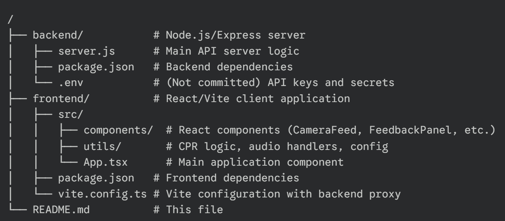

# PulseAI: AI-Powered CPR Training Assistant

[](https://pulseai-v2.onrender.com/)
[](https://opensource.org/licenses/MIT)
[](https://reactjs.org/)
[](https://nodejs.org/)

**PulseAI** is a web-based CPR training assistant that provides real-time, AI-powered feedback on your technique. Using just your webcam, PulseAI analyzes your compression rate, depth, and hand placement to help you perform high-quality CPR. It also features an integrated AI assistant (powered by Google Gemini and OpenAI) to answer your questions during training.

This repository contains the complete monorepo for PulseAI, including the React frontend and the Node.js/Express backend.

---

## Table of Contents

-   [Features](#features)
-   [Technology Stack](#technology-stack)
-   [Project Structure](#project-structure)
-   [Local Development](#local-development)
    -   [Prerequisites](#prerequisites)
    -   [Installation & Setup](#installation--setup)
-   [Environment Variables](#environment-variables)
-   [API Endpoints](#api-endpoints)
-   [Deployment](#deployment)
-   [Troubleshooting](#troubleshooting)
-   [Security & Secrets](#security--secrets)
-   [License](#license)

---

## Features

* **Real-time CPR Metrics:** Get immediate visual feedback on your **BPM**, **compression depth** (mm), and **hand placement** using your webcam.
* **AI-Powered Q&A:** Ask CPR-related questions (via text or voice) and get concise, audible answers from **Google Gemini** or **OpenAI**.
* **Voice Transcription & TTS:** Uses **OpenAI Whisper** for speech-to-text and **ElevenLabs** for realistic text-to-speech responses.
* **Two Training Modes:**
    * **Bystander Mode:** A step-by-step walkthrough for first-time responders.
    * **EMT Mode:** Advanced real-time analysis for trained professionals to refine their technique.
* **Audio/Visual Metronome:** A pulsing visual indicator and optional audio beeps to guide your compression rhythm at the target 100-120 BPM.
* **Session Data Export:** Save your per-second CPR metrics as a JSON file for review.

---

## Technology Stack

### Frontend
* **Framework:** React 18 with TypeScript
* **Build Tool:** Vite
* **Pose Detection:** TensorFlow.js (MoveNet)
* **Styling:** TailwindCSS
* **Animations:** Framer Motion

### Backend
* **Runtime:** Node.js
* **Framework:** Express
* **File Uploads:** Multer

### AI & External Services
* **Generative AI:** Google Gemini (primary) & OpenAI (fallback)
* **Speech-to-Text:** OpenAI Whisper
* **Text-to-Speech:** ElevenLabs

---

## Project Structure

The project is a monorepo containing the frontend and backend in separate directories.


---

## Local Development

### Prerequisites

* Node.js (v16+ recommended)
* npm (v8+ recommended)
* A modern web browser (Chrome, Firefox, Edge)
* API keys for **OpenAI**, **Google Gemini**, and **ElevenLabs**

### Installation & Setup

1.  **Clone the Repository:**
    ```sh
    git clone [https://github.com/your-username/pulseai-v2.git](https://github.com/your-username/pulseai-v2.git)
    cd pulseai-v2
    ```

2.  **Install Backend Dependencies:**
    ```sh
    cd backend
    npm install
    ```

3.  **Install Frontend Dependencies:**
    ```sh
    cd ../frontend
    npm install
    ```

4.  **Set Up Environment Variables:**
    * In the `backend/` directory, create a file named `.env`.
    * Copy the contents of `backend/.env.example` (if present) or use the list from the [Environment Variables](#environment-variables) section below.
    * Add your API keys to this file. **Do not commit this file.**
    ```env
    # backend/.env
    PORT=3001
    ELEVENLABS_API_KEY=your_elevenlabs_key
    GEMINI_API_KEY=your_gemini_key
    OPENAI_API_KEY=your_openai_key
    VOICE_ID=EXAVITQu4vr4xnSDxMaL
    ```

5.  **Run the Servers:**
    You will need two separate terminals.

    * **Terminal 1: Start the Backend**
        ```sh
        cd backend
        npm run dev
        # Server will run on http://localhost:3001
        ```

    * **Terminal 2: Start the Frontend**
        ```sh
        cd frontend
        npm run dev
        # App will be available at http://localhost:5173 (or as shown)
        ```

6.  **Open the App:**
    Open the frontend URL (e.g., `http://localhost:5173`) in your browser. The frontend is configured to proxy `/api` requests to the backend server.

---

## Environment Variables

The backend server requires the following environment variables to be set in a `backend/.env` file.

| Variable | Description | Default | Required |
| :--- | :--- | :--- | :--- |
| `PORT` | The port for the backend server to run on. | `3001` | Optional |
| `ELEVENLABS_API_KEY` | Your API key for ElevenLabs TTS. | - | **Yes** |
| `VOICE_ID` | The ElevenLabs voice ID to use for TTS. | `EXAVITQu4vr4xnSDxMaL` (Sarah) | Optional |
| `GEMINI_API_KEY` | Your API key for Google Gemini (Generative AI). | - | **Yes** |
| `OPENAI_API_KEY` | Your API key for OpenAI (Whisper & GPT fallback). | - | **Yes** |
| `GEMINI_MODEL` | The specific Gemini model to use. | `gemini-2.5-pro` | Optional |
| `ANSWER_MAX_WORDS` | Truncates AI text answers to this many words. | `20` | Optional |

---

## API Endpoints

The backend server exposes the following API endpoints:

* `GET /health`
    * A basic health check to confirm the server is running.
* `POST /api/tts`
    * Generates speech from text.
    * **Body:** `{ "text": "Your text to synthesize" }`
    * **Returns:** `audio/mpeg`
* `POST /api/transcribe`
    * Transcribes audio to text using OpenAI Whisper.
    * **Body:** `multipart/form-data` with an `audio` file.
    * **Returns:** `{ "text": "Transcribed text" }`
* `POST /api/query`
    * Asks a question to the AI (Gemini/OpenAI) and returns a spoken answer.
    * **Body:** `{ "question": "Your question", "context": "Optional context" }`
    * **Returns:** `audio/mpeg` (with text in `X-Answer-Text` header).
* `POST /api/summarize`
    * *Note: This endpoint is defined in the README but not fully implemented in `server.js`.*

---

## Deployment

To deploy this application, you must host the `frontend` (as a static site) and the `backend` (as a Node.js service).

* **Frontend:** Build the static files using `npm run build` inside the `frontend` directory and serve them from any static hosting provider (like Render, Vercel, or Netlify).
* **Backend:** Deploy the `backend` directory as a Node.js service (e.g., on Render).
* **Crucial:** You **must** set the [Environment Variables](#environment-variables) (like `GEMINI_API_KEY`, `OPENAI_API_KEY`, etc.) in your hosting platform's dashboard.
* **CORS:** The backend is configured with `cors()`, but ensure your frontend URL is allowed if you host them on different domains.

For detailed instructions on deploying to Render, see `RENDER_DEPLOYMENT.md`.

---

## Troubleshooting

* **`FETCH_FAILED` or 404 on `/api/query`:**
    * Ensure your backend server is running on `PORT` 3001.
    * Check the browser console for network errors.
* **`OpenAI API key invalid` / `API_KEY_INVALID`:**
    * Your `OPENAI_API_KEY` in `backend/.env` is incorrect or has expired.
    * Regenerate your key, update the file, and restart the backend.
* **Audio playback error:**
    * Check that your `ELEVENLABS_API_KEY` is correct and your account has credits.
* **AI responses fail:**
    * Check your `GEMINI_API_KEY` and `OPENAI_API_KEY`. The backend logs will show `✓ Configured` or `✗ Missing` for each key on startup.

---

## Security & Secrets

**⚠️ Never commit your `.env` file or hardcode API keys in your code.**

* All API keys are secrets and must be stored securely in a local `backend/.env` file, which is included in `.gitignore`.
* When deploying, use your hosting provider's "secrets" or "environment variables" dashboard to set these values securely.
* If you accidentally commit a key, **revoke it immediately** from the provider's dashboard and generate a new one.

---

## License

This project is licensed under the **MIT License**.

## Contact
Hriday Unadkat (@shark66124 on Discord, hu0294@princeton.edu, 703-991-3088), Lynn Morris III (@lynyrd925, 434-409-3218), Eshaan Govil (@EshGov16, 609-436-8199), Samiksha Gaherwar (404-980-3645)
